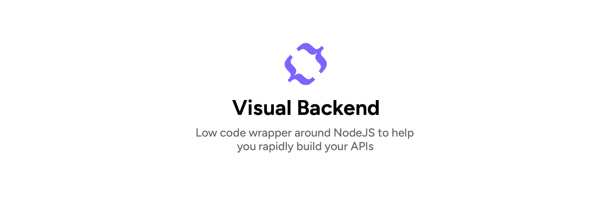
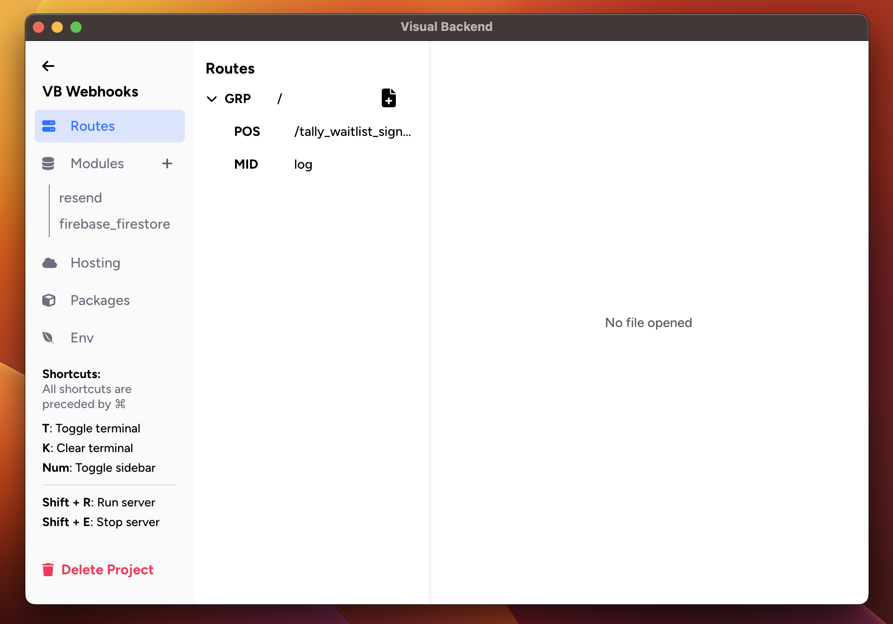

## Visual Backend

Visual Backend is a low code wrapper around NodeJS which helps you rapidly build APIs by offering an intuitive interface that automates boilerplate actions (e.g. configuring your project router, managing your project directory), allowing you to write the functions that truly matter to your app immediately.

There are 3 primary features of Visual Backend:

1. **API Builder**
	- Create your route functions in one click
	- Manage & organise your routes via an intuitive tree view similar to what you'd see when managing your folders & files

2. **Modules**
	- The section to manage your usage of external services like Firebase, Stripe, etc.
	- Set up and initialise your external services simply by adding required config files (e.g. API key) and clicking a button
	- Start off with common functions for each module
	- Use GPT to kickstart your functions without having to write a single prompt
	- We currently have support for the following modules:
		1. Firebase Auth & Firestore
		2. MongoDB
		3. JWT 
		4. Stripe
		5. Resend
		6. GPT

3. **Hosting**
	- Deploy your app in just one click
	- Environment variables are automatically transferred to the cloud for you (and securely using GCloud Secret Manager)





## Install

**Clone project**

```
git clone https://github.com/vbackend/visual-backend.git visual-backend
```

**Install dependencies**

```
npm install
```

**Start the app**

```
npm start
```

**Configuring the node binary to use**

Normally, there will be zipped node binaries in the assets folder of the project, which will later be unzipped to the userData folder for regular users of Visual Backend. When you clone this repo however, these zipped binaries won't be included in the assets folder. Thus, you must configure the path to your node binary in a .env file like so, with the path replaced with your one:

```.env
NODE_BINARY_PATH=/Users/johnyeocx/.nvm/versions/node/v16.20.2/bin
```

Make sure that the path is not to the node binary itself, but the binary folder containing node, npm & npx

**Note:** Hosting & OpenAI usage is run on the Visual Backend server, and is therefore not available with a self-hosted copy of this tool. To learn how to host your Visual Backend project by yourself, read the following: 

**GPT Usage**: We are currently working on adding support for using your own OpenAI API key, however, at this stage, it is not currently available


## Documentation

We are working on developing a proper website for Visual Backend documentation. At the moment however, you may find the appropriate guides for understanding Visual Backend and the codebase over [here](https://github.com/vbackend/visual-backend/tree/main/docs/01_How_It_Works.md)


## Contributing

- [Contribution Guide](https://github.com/vbackend/visual-backend/CONTRIBUTIONS.md)


## Authors

**John Yeo (@johnyeocx)**
- Email: john@visual-backend.com

## License

MIT License
