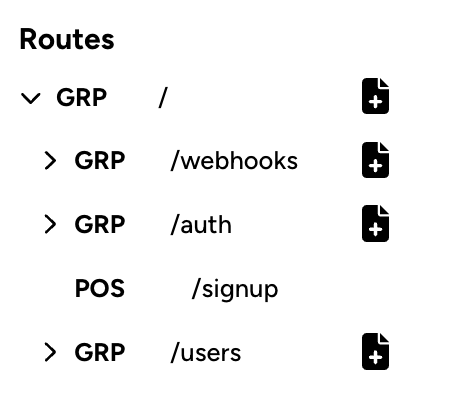
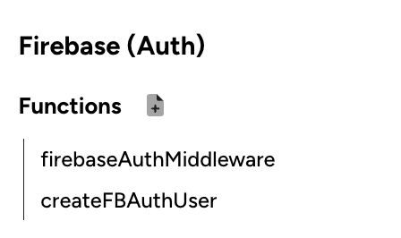
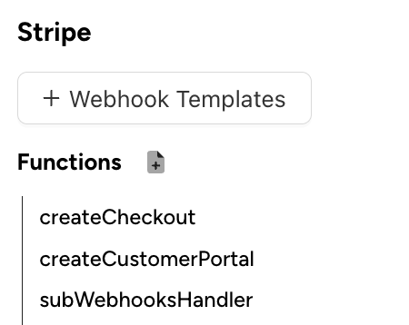

## Terminology

| Term | Meaning |
| ---------- | --------- | 
| **Project** | This refers to the project which you create in Visual Backend | 
| **Route / Endpoint** | This refers to a route or endpoint in the API builder of your project |
| **Module** | This refers to an external service that you can add under the modules section of your project |
| **Section** | When talking about the UI, a section refers to the tab you are on, for instance, the Routes section, or the Hosting section |
| **userData directory** | This comes from electron's app.getPath('userData') method, and for each platform, the actual path returned is shown below

app.getPath('userData') returns:
- **Mac:** /Users/{username}/Library/Application Support/visual-backend
- **Windows:** C:\Users\{username}\AppData\Roaming\visual-backend

## Structure of Visual Backend

You can think of Visual Backend as having the following structure:
```bash
|--  Project
|  |--  Routes
|  |--  Modules
|  |--  Hosting
|  |--  Packages
|  |--  Env
```

Most of the **hosting** features are written on the backend server, and simply uses a GCloud pipeline. This won't be covered here. Additionally, understanding the **packages** and **env** sections are relatively straightforward and also won't be covered.

## Project


[**Project Object**](https://github.com/vbackend/visual-backend/tree/main/src/shared/models/project.ts)

A project simply refers to a single NodeJS API server which you work on through Visual Backend. The project object contains the following relevant fields:

| Field | Type | Meaning |
| ---------- | --------- | --------- |  
| id | string | ID of the project stored in Visual Backend's backend DB (which uses Mongo) | 
| name | string | Name of the project |
| key | string | Key of the project. This is important because it is also the folder name of the project on your local machine, and is used a lot when generating code and writing to the specific project's folder |

You may see the additional fields of gitlabProjectId, projectAccessToken & triggerId. These are only relevant to the hosting feature on Visual Backend's server.

**Creating a project**
- When you create a project in Visual Backend, you essentially begin an empty NodeJS Express app
- This creates a new NodeJS app folder under the ***userData*/projects** directory on your local machine, with the project key as the folder name

**SQLite DB**
- Each project has a SQLite {project_key}.db file inside its folder
- The purpose of this is to keep track of the different routes, modules & functions created for each project, which will be used by Visual Backend in the project view to allow you to manage these things
- Inside each project DB, there are three tables (route, module and func) which will be explained more in the following sections, but the structure of each table is as follows:

[**Table 1: route table**](https://github.com/vbackend/visual-backend/tree/main/src/shared/models/route.ts)

| Field | Meaning |
| ---------- | --------- | 
| route_id | ID of the route as an integer | 
| parent_id | ID of the parent route as an integer (for the root route, this is -1) |
| route_key | Key of the route as a string (should be a valid path AND JS function name, with the exception of ':' at the start for dynamic paths) |
| parent_path | URL path of the parent of this route as a string |
| parent_file_path | File path of the parent of this route as a string |
| type | Type of route as a string. This can be grp, middleware, post, etc. |

[**Table 2: module table**](https://github.com/vbackend/visual-backend/tree/main/src/shared/models/BModule.ts)

| Field | Meaning |
| ---------- | --------- | 
| module_id | ID of the module as an integer | 
| key | Key of the module as a string (e.g. mongo, stripe, firebase_auth) |
| path | File path where this module's files are located in the project (e.g. for firebase_auth, the path is *firebase/auth*, for stripe it's just *stripe*) |
| init | Type of init required as a string (e.g. for firebase_auth, 'firebase' init is required, which simply calls the function to connect to the client)|
| metadata | Additional details for the module as a stringified JSON (e.g. firebase_firestore has a collections array stored in the metadata) |

[**Table 3: func table**](https://github.com/vbackend/visual-backend/tree/main/src/shared/models/BFunc.ts)

| Field | Meaning |
| ---------- | --------- | 
| func_id | ID of the function as an integer | 
| key | Key of the function as a string, which will also act as the function name in the project |
| module_key | Key of the module which this function belongs to |
| func_group | The group that this function is under (applicable for DB based modules like mongo, where the func group is normally the collection name), or else it's just '\*' |
| extension | file extension of the function (at the moment there's just .html and .ts) |


## API Structure & Routes

The aim of the routes section in Visual Backend is to make it easier and more intuitive for the user to build their API. Essentially, it offers the following advantages:

- An intuitive view to manage and view your API structure as a tree
- The ability to create a route in just one click, without worrying about project structure or router configuration

**Creating a route:**
1. You can find the function for this [here](https://github.com/vbackend/visual-backend/tree/main/src/main/ipc/project/routeFuncs.ts#L44)
2. All routes are contained inside the src/api folder of the project
3. Creating a route can mean one of the following:
	- Creating a route group
	- Creating a middleware
	- Creating a http request endpoint
4. Each of these will insert a new route object in the sqlite route table. 
5. The naming convention for routes in Visual Backend is **snakecase**
6. Every time a new route is created, the group that it's under will have its router file rewritten by calling the **writeRouterFile** function [here](https://github.com/vbackend/visual-backend/tree/main/src/main/generate/endpoints.ts#L11)

**Route groups:**
- When you create a route group, a new folder with the name {route_key} will be created under the parent group's folder
- Inside this folder, a **{route_key}Router.ts** file will be created, and will look something like this: 
```typescript
import express from 'express'
import { get_posts } from './get_posts.js'
import { auth_middleware } from './auth_middleware.js'
export const usersRouter = express.Router();
usersRouter.use(auth_middleware)
usersRouter.get('/posts', get_posts)
```

- Inside the router file, middlewares will be called first, followed by http request handlers

**Endpoints & Middleware:**
- Each endpoint & middleware function created will have its own file, which will be written under its parent route group's folder
- The file will look something like this:
```typescript
export const log_middleware = async (req, res, next) => {
	// Complete function
}
```

**Route Manager UI:**
- The UI for the route manager section in Visual Backend is rendered as a tree structure using recursion.



- Each route comes from the **RouteRow** component which can be found [here](https://github.com/vbackend/visual-backend/tree/main/src/renderer/screens/Project/SectionManager/RouteRow.tsx)

## Module & Module Functions

The aim of modules in Visual Backend is to make it easier & faster to work with common external services like Firebase, Stripe, etc. This is essentially done through the following:

1. Setting up the client for an external service automatically (all the user does is provide config information like API keys for that service)
2. Automatically generating commonly used functions (like auth middleware functions for the JWT & Firebase Auth module)
3. Autogenerating code for the user with GPT using existing information like module name, function name, etc. without having the user write a prompt

**Creating a module**
- When you create a module, you do the following:
	1. Add a new module the the SQLite DB module table
	2. Write the necessary env variables
	3. Install the necessary NPM packages
	4. Write the necessary init file (this is primarily for setting up the client)
	5. Create the starter functions for that module

- For each module, the necessary parameters to perform the above actions are specified in the **modConfig** object (inside the BModule.tsx file), which can be found [here](https://github.com/vbackend/visual-backend/tree/main/src/shared/models/BModule.tsx)

- When generating initialisation functions or starter functions for the modules, the templates for each of these can be found in the **assets/code-templates** folder, which can be found [here](https://github.com/vbackend/visual-backend/tree/main/assets/code-templates)

**An example of creating the resend module**
This is what the resend config looks like:

```tsx
{
	key: BModuleType.Resend,
	init: 'resend',
	path: 'resend',
	metadata: {},
	starterFile: 'resendStarter.txt',
	starterFuncs: ['sendEmail'],
	initFile: 'initResend.txt',
	dependencies: ['resend', 'ejs'],
	envVars: [envConsts.RESEND_API_KEY],
	type: 'basic',
	title: 'Resend',
	gptDetails: '',
	createComp: (setSelection: any, selection: any) => (
		<CreateResend setSelection={setSelection} selection={selection} />
	),
}
```

1. First, the module will be added to the SQLite DB, and the fields to be added are the first 4 in the object above:
	- key
	- init
	- path
	- metadata

2. Second, the env variables will be written to the project's .env file, which in the case of resend is just the **RESEND_API_KEY**, as seen under the **envVars** field

3. Third, the **resend** & **ejs** npm packages will be installed, as can be seen under the **dependencies array**

4. Fourth, the resend init file will be written to the project, and the template for this comes from the **initResend.txt** found [here](https://github.com/vbackend/visual-backend/tree/main/assets/code-templates/resend/initResend.txt)

5. Lastly, the starter functions will be created. This is done by first inserting a function into the func table of the project's SQLite DB, and then writing the function file into the project. For instance, the **sendEmail** function is a starter function generated when the resend module is added, and the template for that can be found Fourth, the resend init file will be written to the project, and the template for this comes from the initResend.txt found [here](https://github.com/vbackend/visual-backend/tree/main/assets/code-templates/resend/sendEmail.txt)

**Module manager UI**
- The manager UI for each module displays information from the module object in the SQLite DB **module table**, as well as the functions belonging to that module, which is found in the SQLite DB **func table**.

- The general case for the manager UI would simply be displaying the functions belonging to that module, and buttons to add and delete functions for that module. The component for this is the **BasicModuleManager** which can be found [here](https://github.com/vbackend/visual-backend/tree/main/renderer/screens/Project/SectionManager/Modules/General/BasicModuleManager.tsx). An example of this is with the **firebase_auth** module.



- For modules that have more specific actions, there is a specific manager component created. For instance, with the stripe module, there is the **'add webhook templates'** button. 



**Creating a module function**
- The process for creating a function for each module follows the same format:
	1. Insert new func object into SQLite func table
	2. Write the function file to the project folder. 
		- This is done by first getting the scaffold for the function through the code-templates/{module_key}/{module_key}Starter.txt. An example of this for the mongo module can be found [here](https://github.com/vbackend/visual-backend/tree/main/assets/code-templates/mongo/mongoStarter.txt)
		- Replacing the func_name with that specified by the user
		- Populating the function with GPT if specified by the user
		- Writing the final code to the file in the project folder

**Editing a module function**
- Editing a function simply comes down to updating the file content for that function, and happens in the editor screen, which can be found [here](https://github.com/vbackend/visual-backend/tree/main/src/renderer/screens/Project/EditorScreen/EditorScreen.tsx).
- The AceEditor component from the **react-ace** package is used for this.
- In main, the functions for getting and writing the file contents can be found [here](https://github.com/vbackend/visual-backend/tree/main/src/main/ipc/project/editorFuncs.ts)


## Deploying your project

Every Visual Backend project is ultimately just a NodeJS express app, and so to deploy it, you can do so in the same way you'd deploy a NodeJS app. 

The NodeJS folder for your app can be found in the following directory:
*userData*/projects/{project_key}